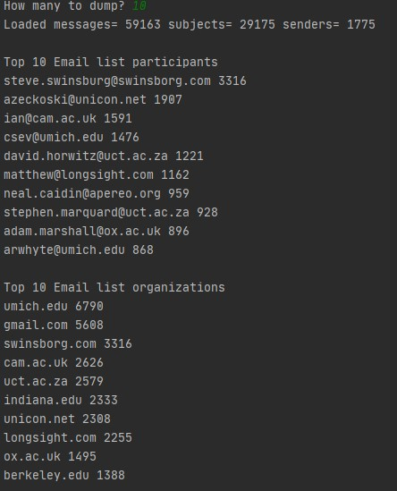
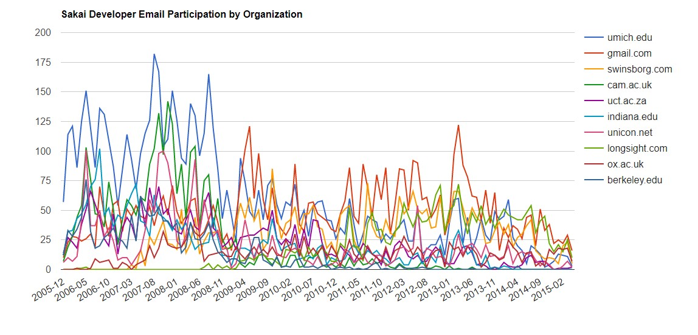
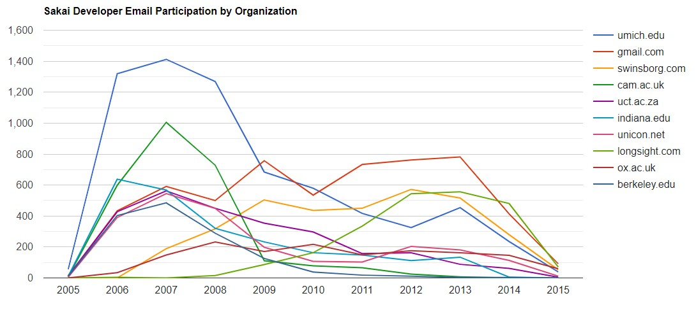

### Analysing an email archieve from gmane and visualising the data using D3 JavaScript Library

For this project, we will not be spidering from:
http://gmane.org/export.php

In order not to overwhelm the gmane.org server, the spidering will be done from:
htto://mbox.dr-chuck.net/

This server will be faster and take a lot of load off the gmane.org server.

The first step is to spider the gmane repository. The base URL is hard-coded in the gmane.py and is hard-coded to the Sakai developer list. It is possible to spider another repository by changing that base url. 
*Note: delete the content.sqlite file when switching the base url*
The gmane.py file operates as a spider in that it runs slowly and retrieves one mail message per second so as to avoid getting throttled by gmane.org. It stores all of its data in a database and can be interrupted and re-started as often as needed. It may take many hours to pull all the data down.

Here is a run of gmane.py getting the last five messages of the sakai developer list:

`
How many messages: 10`
`
http://mbox.dr-chuck.net/sakai.devel/59848/59849 18612
    shaowei.zhang@yale.edu 2015-04-14T23:32:19+00:00 re: re: sakai upgrade database script
http://mbox.dr-chuck.net/sakai.devel/59849/59850 6696
    warwickchapman@gmail.com 2015-04-15T08:26:03+02:00 error in lessons when trying to restrict access to a
http://mbox.dr-chuck.net/sakai.devel/59850/59851 10564
    matthew@longsight.com 2015-04-15T08:55:01-04:00 re: allowing assignment tool to grade using two decimal points
http://mbox.dr-chuck.net/sakai.devel/59851/59852 12130
    holladay@longsight.com 2015-04-15T09:32:48-04:00 re: sakai 2.9.x msgcntr
http://mbox.dr-chuck.net/sakai.devel/59852/59853 21823
    matthew@longsight.com 2015-04-15T10:04:52-04:00 re: sakai 2.9.x msgcntr
Does not start from`

The program scans content.sqlite from 1 up to the first message number not already spidered and starts spidering at that message. It continues spidering until it has spidered the desired number of messages or it reaches a page that does not appear to be a properly formatted message.

The content.sqlite data is raw, with an inefficient data model, and not compressed. This is intentional as it allows us to look at content.sqlite to debug the process. It would be a bad idea to run any queries against this database as they would be slow.

The second process is running the program gmodel.py. This program reads the rough/raw data from content.sqlite and produces a cleaned-up and well-modeled version of the data in the file index.sqlite. The file index.sqlite will be much smaller (often smaller) than content.sqlite because it also compresses the header and body text.

Each time gmodel.py runs - it completely wipes out and re-builds index.sqlite, allowing us to adjust its parameters and edit the mapping tables in content.sqlite to tweak data cleaning process.

Running gmodel.py works as follows:
`Loaded allsenders 1781 and mapping 29 dns mapping 1
1 2005-12-08T23:34:30-06:00 ggolden22@mac.com
251 2005-12-22T10:03:20-08:00 tpamsler@ucdavis.edu
501 2006-01-12T11:17:34-05:00 lance@indiana.edu
751 2006-01-24T11:13:28-08:00 vrajgopalan@ucmerced.edu
.......`

The gmodel.py program does a number of data cleaning steps:
Domain names are truncated to two levels for .com, .org, .edu, and .net whereas other domain names are truncated to three levels. So si.umich.edu becomes umich.edu and caret.cam.ac.uk becomes cam.ac.uk. Also mail addresses are forced to lower case and some of the @gmane.org addresses like the following
 arwhyte-63aXycvo3TyHXe+LvDLADg@public.gmane.org
are converted to the real address whenever there is a matching real email address elsewhere in the message corpus.

The third process is running a simple data analysis using gbasic.py:

The fourth process is running a simple visualisation of the word frequence in the subject lines in the file gword.py:
`Range of counts: 43398 326`

A second visualisation is in gline.py. It visualises email participation by organisations over time.
For a monthly timeline, the running gline.py would obtain:
`Loaded messages= 59163 senders= 1775
Top 10 Organizations
['umich.edu', 'gmail.com', 'swinsborg.com', 'cam.ac.uk', 'uct.ac.za', 'indiana.edu', 'unicon.net', 'longsight.com', 'ox.ac.uk', 'berkeley.edu']`

For a yearly timeline:
`Loaded messages= 59163 senders= 1775
Top 10 Organizations
['umich.edu', 'gmail.com', 'swinsborg.com', 'cam.ac.uk', 'uct.ac.za', 'indiana.edu', 'unicon.net', 'longsight.com', 'ox.ac.uk', 'berkeley.edu']
Output written to gline.js`

